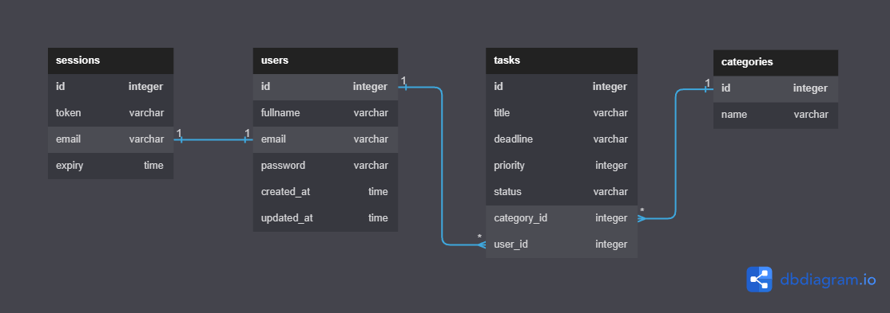

# Web Application

## Final Course Project - Task Tracker Plus

### Description

**Task Tracker Plus** merupakan final project dari Backend Engineering Ruangguru CAMP. **Task Tracker Plus** dirancang untuk membantu mahasiswa dalam mengatur jadwal studi mereka dan dibuat menggunakan bahasa pemrograman Go (Golang).

Aplikasi ini mengimplementasikan konsep **REST API** dan juga mengimplementasikan konsep **MVC**. Aplikasi ini adalah **monolith** dimana seluruh sistemnya memakai server, logika, database, hingga user interface yang sama:

#### Server (Backend)

- **users**
  - Mengirim permintaan **POST** ke endpoint `/user/register` untuk proses registrasi
  - Mengirim permintaan **POST** ke endpoint `/user/login` untuk proses login
  - Mendapatkan daftar user dengan task dan kategorinya dengan mengirimkan permintaan **GET** ke endpoint `/user/tasks`.
- **task**
  - Menambahkan tugas baru dengan mengirimkan permintaan **POST** ke endpoint `/task/add`.
  - Mengambil informasi tugas berdasarkan ID dengan mengirimkan permintaan **GET** ke endpoint `/task/get/:id`.
  - Memperbarui informasi tugas dengan mengirimkan permintaan **PUT** ke endpoint `/task/update/:id`.
  - Menghapus tugas dengan mengirimkan permintaan **DELETE** ke endpoint `/task/delete/:id`.
  - Mendapatkan daftar tugas dengan mengirimkan permintaan **GET** ke endpoint `/task/list`.
  - Mendapatkan daftar tugas berdasarkan ID kategori dengan mengirimkan permintaan **GET** ke endpoint `/task/category/:id`.
- **category**
  - Menambahkan kategori baru dengan mengirimkan permintaan **POST** ke endpoint `/category/add`.
  - Mengambil informasi kategori berdasarkan ID dengan mengirimkan permintaan **GET** ke endpoint `/category/get/:id`.
  - Memperbarui informasi kategori dengan mengirimkan permintaan **PUT** ke endpoint `/category/update/:id`.
  - Menghapus kategori dengan mengirimkan permintaan **DELETE** ke endpoint `/category/delete/:id`.
  - Mendapatkan daftar kategori dengan mengirimkan permintaan **GET** ke endpoint `/category/list`.

API ini menggunakan database **PostgreSQL** untuk menyimpan data pengguna, tugas dan kategori.

> **Note**: untuk mengakses endpoint `task` dan `category` pengguna harus melakukan login terlebih dahulu.

#### Client (Frontend)

- **index**
  - Halaman landing page dari aplikasi ini dapat diakses dari root endpoint `/`

    > Disini berjalan di `http://localhost:8080/`

- **users**
  - Tampilkan halaman login dengan endpoint `/client/login`.
  - Proses autentikasi pengguna dengan endpoint `/client/login/process` menggunakan metode **POST**.
  - Tampilkan halaman registrasi dengan endpoint `/client/register`.
  - Proses pendaftaran pengguna baru dengan endpoint `/client/register/process` menggunakan metode POST..
  - Logout pengguna dengan endpoint `/client/logout`.

- **dashboard**
  - Tampilkan halaman dashboard dengan endpoint `/client/dashboard`.

- **task**
  - Tampilkan halaman tugas dengan endpoint `/client/task`.

- **category**
  - Tampilkan halaman kategori dengan endpoint `/client/category`.

- **modal**
  - Tampilkan halaman modal dengan endpoint `/client/modal`.

### Database Model and Schema

Aplikasi ini memiliki 4 tabel utama, yaitu `sessions`, `users`, `tasks` dan `categories`. Tabel  `sessions` digunakan untuk menyimpan data session dari pengguna yang sedang login, tabel`users` digunakan untuk menyimpan data pengguna, tabel `tasks` digunakan untuk menyimpan data-data tugas dan tabel `categories` digunakan untuk menyimpan data-data kategori.

Satu `user` bisa memiliki satu `sessions` sehingga memiliki relasi `one to one`. Satu `user` bisa memiliki banyak `task` dan satu kategori bisa memiliki banyak `task`, sehingga relasi antara `user` dengan `task` adalah `one to many`, begitu juga dengan relasi `category` dengan `task`, `one-to-many`.